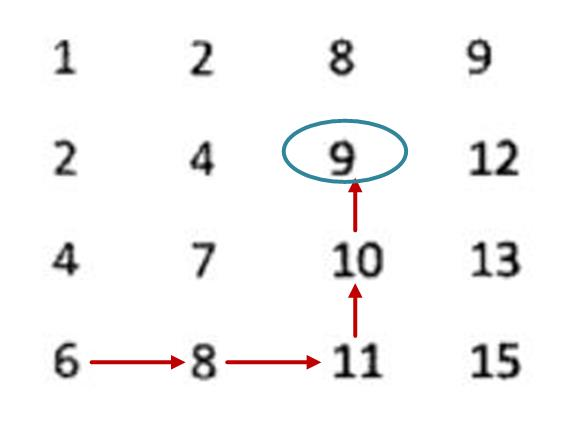

## 题目描述
在一个二维数组中，每一行都按照从左到右递增的顺序排序，每一列都按照从上到下递增的顺序排序。请完成一个函数，输入这样的一个二维数组和一个整数，判断数组中是否含有该整数。

## 思路
1. 暴力解法，两重循环。
2. 二维数组排序方式是特别的，从左到右从上到下依次递增，因此采取从左下角或者右上角作为起点去排查。 
从左下角开始遍历，当前元素是该列最大值，因此若目标元素大于当前元素，则向右继续查找；若目标元素小于当前元素，则向上查找。这样就保证了仅有一条查找路径。如下图示例： 

 
同理，我们可以从右上角开始查找